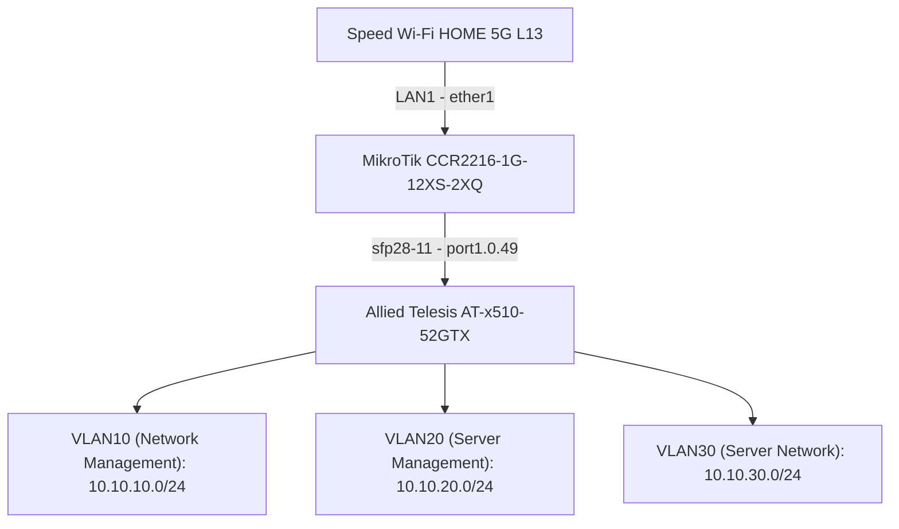

# Home Rack Setup Work Log 2026-06-24

## Aim

Set up the network for the home rack.

In addition, as a temporary setup while waiting for fiber internet activation, connect a mobile home
router (Speed Wi-Fi HOME 5G L13) to the WAN port of the core router (MikroTik CCR2216-1G-12XS-2XQ)
and build a management network inside the home rack.

## Network Topology



## IP / VLAN Design

Using the `10.10.vlan.0/24` scheme.

### VLAN 10: Network Management

- Subnet: 10.10.10.0/24
- Gateway: 10.10.10.1

IP allocation plan:

- 10.10.10.1       Mikrotik CCR2216-1G-12XS-2XQ (Gateway)
- 10.10.10.2-10    Reserved (future routers / L3 devices)
- 10.10.10.11      Allied Telesis AT-x510-52GTX
- 10.10.10.12-254  Unallocated

Use cases: Router management, Switch management, Network device management, Admin PC connection

### VLAN 20: Server Management / OOB

- Subnet: 10.10.20.0/24
- Gateway: 10.10.20.1

Planned iDRAC IPs:

- R440 iDRAC: 10.10.20.11
- R540 iDRAC: 10.10.20.12
- R640 iDRAC: 10.10.20.13

### VLAN 30: Server Network

- Subnet: 10.10.30.0/24
- Gateway: 10.10.30.1

## x510 Port Assignments

- port1.0.1-12: VLAN20 access
- port1.0.37-48: VLAN10 access
- port1.0.49: Trunk CCR2216 sfp28-11 uplink (VLAN10/20 tagged)

## x510 Configuration

### Create VLANs

```console
vlan database
  vlan 10 name network-management
  vlan 20 name server-management
exit
```

### Uplink port (port1.0.49) trunk configuration

```console
interface port1.0.49
  switchport mode trunk
  switchport trunk allowed vlan add 10,20
  switchport trunk native vlan none
exit
```

### VLAN10 access ports

```console
interface port1.0.37-1.0.48
  switchport mode access
  switchport access vlan 10
exit
```

### VLAN20 access ports (iDRAC)

```console
interface port1.0.1-1.0.12
  switchport mode access
  switchport access vlan 20
exit
```

### Management IP and default route

```console
interface vlan1
  no ip address
exit

interface vlan10
  ip address 10.10.10.11/24
exit

ip route 0.0.0.0/0 10.10.10.1
```

### Disable stacking (faster boot)

```console
no stack 1 enable
```

### Save

```console
write memory
```

## Completed

- Connected the L13 mobile router (LAN1) to the CCR2216 WAN port (ether1) for temporary internet
  access.

- Connected the CCR2216 (sfp28-11) to the x510 (port1.0.49) as the management uplink.

- Configured the x510:
  - Created VLAN 10 (network-management) and VLAN 20 (server-management).
  - Set port1.0.49 as a trunk with VLANs 10 and 20 tagged, native VLAN none.
  - Assigned port1.0.37-48 as VLAN10 access ports.
  - Assigned port1.0.1-12 as VLAN20 access ports for iDRAC.
  - Removed the IP from vlan1 and assigned the management IP 10.10.10.11/24 on vlan10.
  - Added a default route via the CCR2216 gateway (10.10.10.1).
  - Disabled stacking for faster boot.
  - Saved the running configuration (`write memory`).

- R440 iDRAC access confirmed
  - Configured at 10.10.20.11 / GW 10.10.20.1
  - SEL shows PCIe slot 2 warning -> caused by Mellanox ConnectX-4 (MCX455A)
  - Card removed; warning disappeared
  - BIOS update planned via Lifecycle Controller

- Remote access investigation
  - IPv4: inbound connections impossible due to CGNAT
  - IPv6: L13 does not distribute to LAN side, so CCR2216 has no global IPv6
  - Workaround: connect Raspberry Pi to VLAN10 (port1.0.37-48) and use as Tailscale relay

## Next Steps

1. Set up remote access via Raspberry Pi
   - Connect Raspberry Pi to x510-1 port1.0.37-48 (VLAN10)
   - Assign IP: 10.10.10.x/24
   - Install Tailscale and configure as relay node
   - Confirm access to each VLAN from remote PC via Tailscale

2. Server BIOS update
   - Use Lifecycle Controller (F10)
   - Requires DNS configured on iDRAC (e.g. 1.1.1.1)

3. Mellanox ConnectX-4 (MCX455A) verification
   - Needs further research

4. Server OS installation
